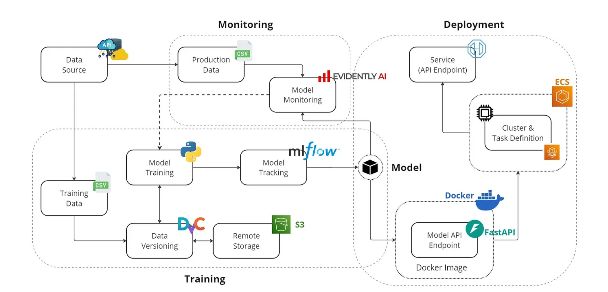
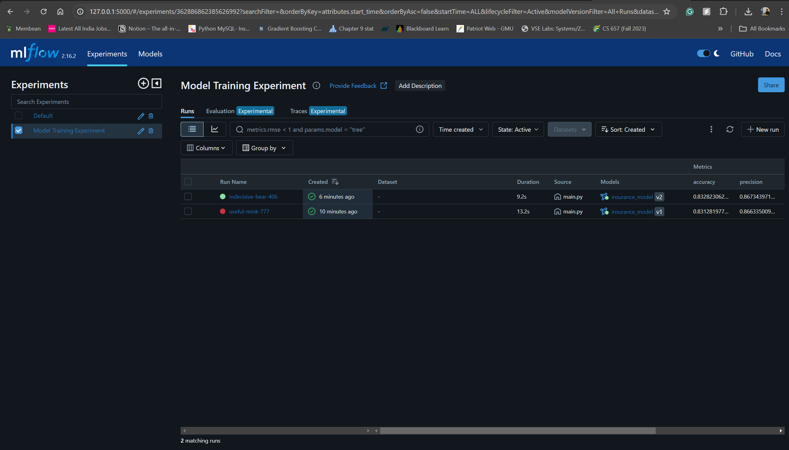
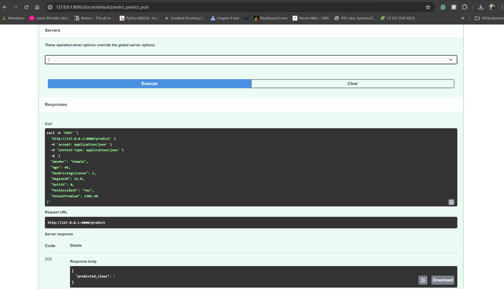
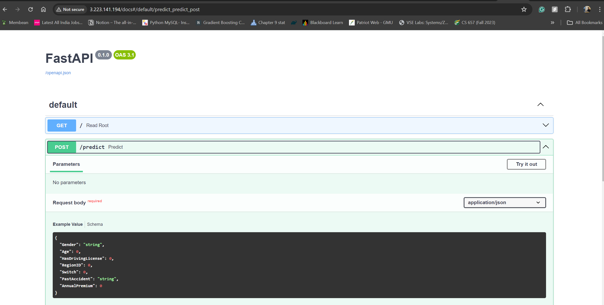
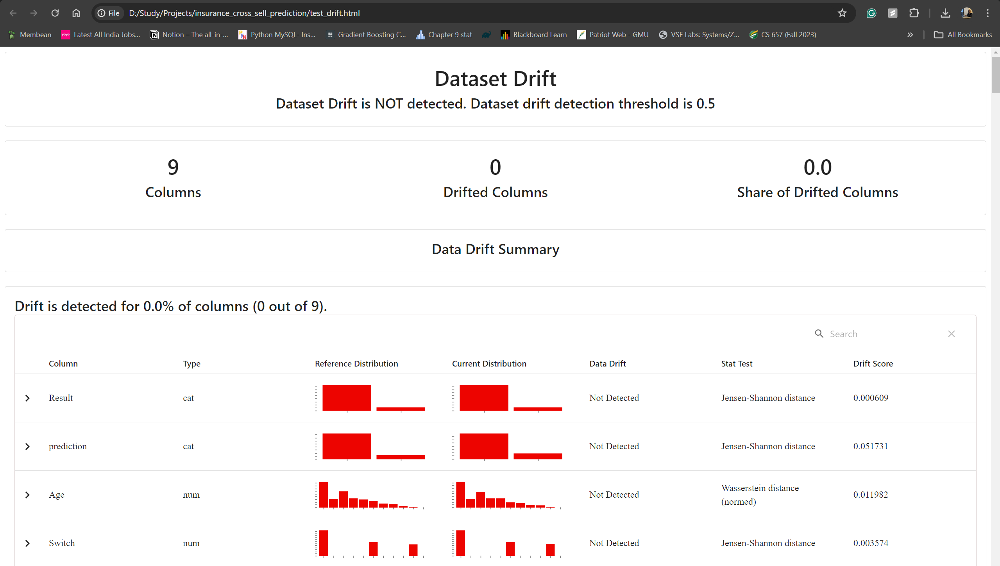

# Insurance Cross-Sell Prediction

The goal of this project is to predict which customers are most likely to purchase additional insurance products using a machine learning model. This project incorporates MLOps practices using MLflow, DVC, and other tools.

## Techstack:
1. Python - Fast API
2. AWS ECS, S3, IAM
3. Jenkins
4. Docker
5. MLflow
6. Evidently AI
7. DVC (Data Version Control)

## Architecture


All the commands are based on windows (Mac/Linux: Subject to change)

## Setup

**Create a virtual environment:**
```bash
python -m venv venv
```

**Activate the environment:**
```bash
.\venv\Scripts\activate
```

**Install all dependencies:**
```bash
pip install -r requirements.txt
```

## Important Files and Their Contents

- `/steps/ingest.py` — Load the dataset.
- `/steps/clean.py` — Clean the dataset.
- `/steps/train.py` — Train the model based on `config.yml` and save the model.
- `/steps/predict.py` — Load the trained model and predict for test data.
- `main.py` — Run the training and evaluation of the model.
- `app.py` — FastAPI endpoint to predict the cross-selling of insurance for a user.
- `config.yml` — Configuration file managing data/model paths, model parameters, and other configurations.
- `Dockerfile` — Docker configuration file.
- `monitor.py` — To monitor the data drift using evident AI package 
               (helpful for production level applications, as new data comes)

## Model Training

```bash
python main.py
```

## Data Version Control (DVC)

DVC is designed to manage large datasets, automate ML pipelines, and handle experiments.

**Install DVC:**
```bash
pip install dvc
```

**Initialize DVC:**
```bash
dvc init
```

**Stop tracking the data folder with Git (if necessary):**
```bash
git rm -r --cached 'data'
git commit -m "stop tracking data"
```

**Add data to DVC:**
```bash
dvc add data
```

**Configure remote storage (using AWS S3):**
```bash
# dvc remote add -d <remote_name> <remote_storage_path>
dvc remote add -d myremote s3://lm-insurance-data/mydata/
# commit the DVC configuration changes to Git
git commit .dvc/config -m 'Configure DVC storage'
```

Setup IAM user in AWS account give s3 full access and then configure aws user in local CLI

**Push data to remote storage:**
```bash
dvc push
```

**Pull the latest version of the data:**
```bash
dvc pull
```

By integrating DVC, we can manage large datasets efficiently while keeping the Git 
repository focused on source code.


## MLflow

After versioning data with DVC, it’s crucial to maintain a clear record of model training, 
version changes, and parameter configurations, even if we are not actively experimenting 
with multiple models.

MLflow is not just for experimenting; it also plays a critical role in tracking the lifecycle 
of ML models. It logs metrics, artifacts, and parameters, ensuring that every version change 
is documented and easily retrievable. With MLflow, we can monitor each run, and compare 
different versions. So that the most effective model is always identifiable and ready for 
deployment.

**Install MLflow:**
```bash
pip install mlflow
```

Then update the main.py file to include logging of parameters, metrics, and models. 
The code will look something like this [see train_with_mlflow method in /main.py]

**Launch MLflow UI:**
```bash
mlflow ui
```

default url: http://127.0.0.1:5000


## FastAPI and Uvicorn

**Install FastAPI and Uvicorn:**
```bash
pip install fastapi uvicorn
```

**Run the FastAPI application:**
```bash
uvicorn app:app --reload
```

**Sample Input:**
```json
{
  "Gender": "Female",
  "Age": 46,
  "HasDrivingLicense": 1,
  "RegionID": 21.0,
  "Switch": 0,
  "PastAccident": "Yes",
  "AnnualPremium": 2305.40
}
```

**Sample Output:**
```json
{
  "predicted_class": 1
}
```



## Containerization with Docker

**Build the Docker image:**
```bash
# docker build -t <image_name> <path_to_dockerfile>
docker build -t insurance_api .
```

**Run the Docker container:**
```bash
# docker run -d -p 80:80 <image_name>
docker run -d -p 80:80 insurance_api
```

Default url: http://localhost:8000/

**To stop the container**
```bash
docker stop <container_id_or_name>
```

**List images by name and tag.**
```bash
docker image ls
```

**Tag the image**
```bash
#docker tag <image_name> <dockerhub_username>/<docker-repo-name>
docker tag insurance_api lokeshmamidi99/insurance_api
```

**Push the Docker image to dockerhub**
```bash
#docker push <dockerhub_username>/<docker-repo-name>:latest
docker push lokeshmamidi99/insurance_api:latest
```

## Deployment on AWS ECS

A step-by-step guide to deploying the Docker container using AWS ECS.

### Create an ECS Cluster
1. Log in to the AWS account then go to the ECS service and create a new ECS cluster by selecting “Create Cluster.”
2. Give a name to the cluster, select AWS Fargate (serverless), and click on “Create.”

### Define a Task Definition
1. In the ECS console, go to “Task Definitions” and create a new task definition.
2. Give the task a name and configure settings such as memory and CPU requirements.
3. Set the Docker image URL from Docker Hub in the container definitions and keep the container port mappings default. Click on “Create.”

### Add a Security Group
1. Go to EC2, then in Networks and Security, select Security Groups and click on “Create Security Group.”
2. Give it a name and description.
3. In Inbound Rules, select the type HTTP and source Anywhere-IPv4 first, then do the same for Anywhere-IPv6. Click “Create Security Group.”

### Create a Service
1. Go to the ECS cluster that was created and add a new service.
2. Select the ‘launch type’ compute options and ‘Fargate’ launch type. Then select the task definition that was created and give the service name in the deployment configuration.
3. Finally, select the security group created earlier under Networking and click “Create.”

### Access the Running Service
Once the service is deployed, go to the ECS cluster’s “Services” tab. Find the service, go to the “Tasks” tab, and select a running task. Open the public IP address of the task to access the FastAPI application.



## Monitoring with Evidently AI

I used Evidently AI to monitor the data drift.

Evidently AI is a good tool for monitoring model performance, detecting data drift, 
and data quality over time. It helps ensure that the model remains accurate and 
reliable as new data comes in. Evidently AI provides detailed insights into how 
model performance evolves and identifies any significant shifts in the data 
distribution, which is crucial for maintaining model accuracy in production 
environments.

**Install Evidently AI:**
```bash
pip install evidently
# or
pip install evidently @ git+https://github.com/evidentlyai/evidently.git

```



Run the monitoring script regularly on incoming data to generate reports on data 
drift and model performance. These reports can help us identify when retraining is 
needed and ensure that our model remains accurate and reliable over time.

## Makefile

Refer to the `Makefile` for automating setup and other processes.